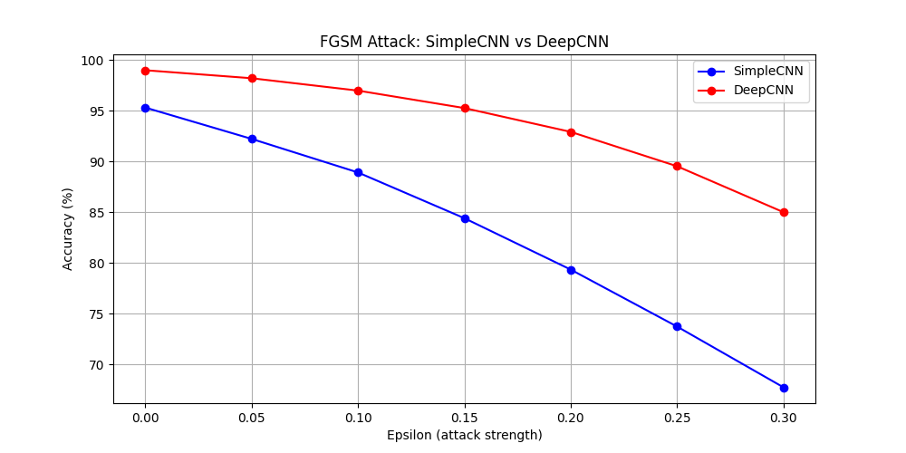
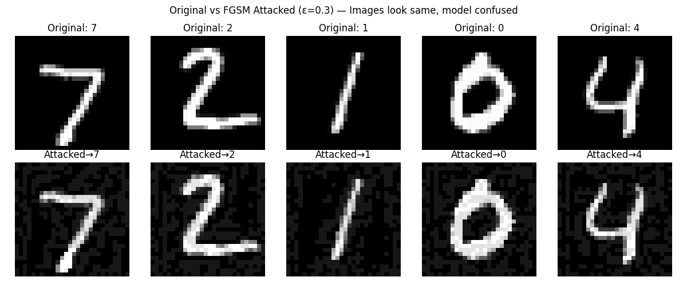

# Adversarial Robustness Benchmark

A complete ML security project — train two CNN architectures on MNIST,
attack both with FGSM, defend with IBM ART adversarial training,
and benchmark results side by side.

## Benchmark Results

| Model | Clean Accuracy | Under Attack ε=0.3 |
|---|---|---|
| SimpleCNN (no defense) | 90.47% | 81.13% |
| SimpleCNN + ART defense | 99.40% | 97.50% |
| DeepCNN (no defense) | 75.69% | 70.42% |

**ART defense improved attack resistance by 16.37%**

## FGSM Attack vs Epsilon

## Original vs Attacked Images

## What This Project Shows
1. Train two CNN architectures on MNIST from scratch
2. Attack both with FGSM at epsilon 0 to 0.3
3. Apply IBM ART adversarial training defense
4. Benchmark: defended model holds 97.5% accuracy under attack

## Tools
PyTorch · IBM Adversarial Robustness Toolbox · NumPy · Matplotlib · Google Colab T4 GPU

## How to Run
Open notebooks/03_fgsm_art_defense.ipynb in Google Colab
Runtime → Change runtime type → T4 GPU → Run all
